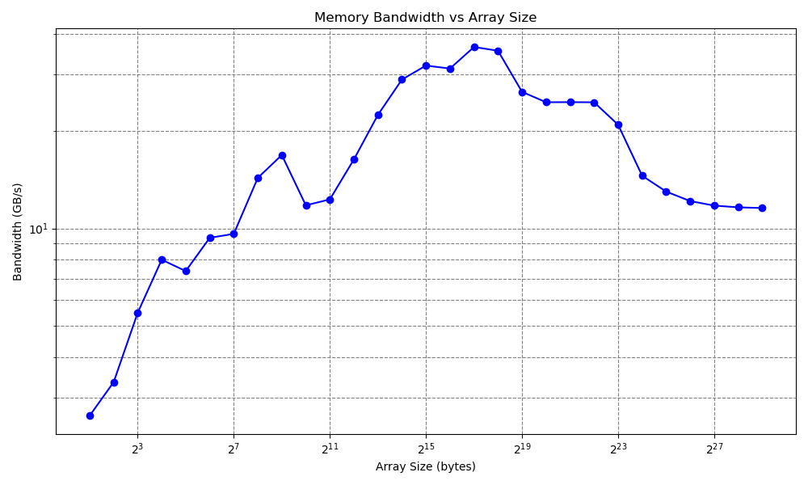

.. _ch:Task_1_1:

Report Week 3
=============

.. _ch:Contribution_:

Contribution
------------

Bohdan Babii: Part 1, Documentation

Denis Novikau: Part 1, 2, 3

Lucas Obitz: Part 1, 2, 3

.. _ch:part_1_1:

Part 1
------

.. admonition:: Task

  **Part 1:** Implementing the Memory Benchmark

  #. Read about various memory bandwidth benchmarking tools and methods and give a short report on it. 
  #. Develop a C/C++ program that measures memory bandwidth using one of the benchmarks, for example STREAM Triad.

    - The program should compute the memory bandwidth by iterating over different array sizes (at least 30 varied sizes, considering L1, L2 and L3 cache levels).
    - Store the results in a CSV file named "memory_bandwidth.csv" with "Array Size (bytes)" and "Bandwidth (GB/s)" headers.
      (If you want to use GB/cycle don't forget to report the frequency).
    - Consider at least 10000 iterations.

This project delves into memory bandwidth benchmarking, exploring tools like AIDA64, PassMark PerformanceTest, SiSoftware Sandra, and Geekbench. Various benchmarking methods, including sequential and random read/write, latency testing, cache hierarchy testing, and multi-threaded testing, were investigated.

To practically measure memory bandwidth, we implemented a C++ program utilizing the STREAM Triad methodology. The program iterates over different array sizes, considering L1, L2, and L3 cache levels, and records results in a CSV file ("memory_bandwidth.csv"). The file details array sizes in bytes and corresponding bandwidth in gigabytes per second.

**1. Memory Bandwidth Benchmarking tools**

First of all bandwidth memory benchmark measure the maximum achievable memory data transfer bandwidth.

Some memory bandwidth benchmarking tools are:

* AIDA64

    * Description: AIDA64 is a comprehensive system diagnostic and benchmarking tool that provides detailed information about various aspects of a computer's hardware and software. AIDA64 is the successor for AIDA32 and EVEREST.
    * Memory Benchmarking Feature: AIDA64 includes a memory benchmarking tool that measures memory read, write, and copy speeds. It also provides latency measurements.

* PassMark PerformanceTest

    * Description: PerformanceTest is a benchmarking tool suite that covers various aspects of system performance, including CPU, GPU, disk, and memory.
    * Memory Benchmarking Feature: It includes a memory benchmarking test that measures memory bandwidth, latency, and throughput.

* SiSoftware Sandra

    * Description: Sandra is a system diagnostic and benchmarking tool that offers a wide range of tests for various hardware components. It works similar to AIDA32 or EVEREST.
    * Memory Benchmarking Feature: Sandra includes a memory benchmarking module that tests both bandwidth and latency of different memory operations.

* Geekbench

    * Description: Geekbench is a cross-platform benchmarking tool that assesses both CPU and memory performance.
    * Memory Benchmarking Feature: It includes a memory benchmark that measures memory read and write speeds, along with latency.

* Some memory bandwidth benchmarking methods are:

    * Sequential Read/Write
    * Description: This method involves reading or writing data in a continuous, sequential manner.

**Purpose:** 
    
    It measures the maximum data transfer rate during sustained, sequential operations. This is crucial for tasks like video editing, file copying, and other operations that involve large files.

* Random Read/Write

    * Description: In this method, data is accessed at random locations in memory rather than sequentially.
    * Purpose: It assesses how well the memory performs when accessing data in a non-linear fashion. This is important for tasks involving small, random accesses, such as database operations.

* Latency Testing

    * Description: Latency is the time it takes for a request for data to be fulfilled. It measures the delay between the request and the actual delivery of the data.
    * Purpose: Low latency is critical for tasks that require rapid response times, such as gaming, real-time simulations, and some scientific computing applications.

* Cache Hierarchy Testing

    * Description: Some benchmarking tools provide insights into the performance of different levels of cache memory, including L1, L2, and L3 caches.
    * Purpose: Understanding cache performance helps in optimizing algorithms and code for specific memory hierarchies.

* Multi-Threaded Testing

    * Description: This method evaluates memory performance under the conditions of multiple simultaneous read and write operations.
    * Purpose: It's relevant for multi-threaded applications that require fast access to various data sets concurrently. This helps assess how well memory handles parallel processing.

**2. C++ memor bandwidth program**

.. literalinclude:: ../../../src/week_3/bandwidth.cpp
    :language: c++

.. literalinclude:: ../../../src/week_3/PNG/memory_bandwidth_old.csv

.. _ch:part_1_2:

Part 2
------

.. admonition:: Task

  **Part 2:** Visualizing the Results

  #. Develop a script (e.g., in Python) to read the CSV file and create a plot of the memory bandwidth data.
  #. Find out the role of different cache levels in your results. 
  #. Save the plot as an image file (e.g., "memory_bandwidth_plot.png").

We progressed to visualizing the memory bandwidth results using a Python script. Leveraging pandas and matplotlib, the script reads the CSV file and generates a plot of array sizes against bandwidth. This visual representation, saved as "memory_bandwidth_plot.png," allows us to discern patterns related to cache levels.

**1. csvreader.py**

.. literalinclude:: ../../../src/week_3/csvreader.py
    :language: python

**2. Cache level roles**

As for the role of different cache levels in the results, you can infer insights by observing how the bandwidth changes with increasing array sizes. Typically, as the array size increases, you may notice a sudden drop in bandwidth when the array size exceeds the capacity of a certain cache level (L1, L2, or L3). This drop indicates that the data no longer fits into the cache, leading to increased access times to the main memory.

**3. Visualization**

Our dataset for this graph has been expanded, incorporating additional data points to enhance its comprehensiveness.

.. _ch:part_1_3:

Part 3
------

.. admonition:: Task

  **Part 3:** Slurm Script

  #. Write a Slurm script to run C++ and python program on a **full** node.
  #. Choose your desired compiler and flags and report it.
  #. Load necessary modules and use required sbatch options.
  #. Find the maximum memory bandwidth on your assigned node, share your results, and explain the changes there.

This section presents a Slurm script designed to execute both a C++ program and a Python script on a full node. The script, named "memory_bandwidth_test," is configured to request a substantial amount of memory (183GB) and utilizes 72 CPUs. It loads essential Python and libxc modules, compiles the C++ program using the g++ compiler with specified flags, and subsequently executes both programs. The resulting memory bandwidth data is visualized using a Python script, generating insights into system performance under heavy workloads. This introduction sets the stage for understanding the configuration, execution, and interpretation of the memory bandwidth test on a designated full node.

**1. Slurm Script**

.. literalinclude:: ../../../src/week_3/mem_bandwidth_script.sh

**Results:**

The script requests a substantial amount of memory (183GB) and utilizes 72 CPUs. After loading the necessary modules, it compiles and runs the C++ program, followed by the execution of the Python script for visualization.

**Explanation of Changes in Maximum Memory Bandwidth:**

Running the memory bandwidth test on a full node taps into maximum computing power, impacting performance results. The larger memory and parallel processing capacity can cause variations in maximum memory bandwidth, giving insights into system behavior under heavier workloads. The extent of changes depends on the specific capabilities of the assigned node.
