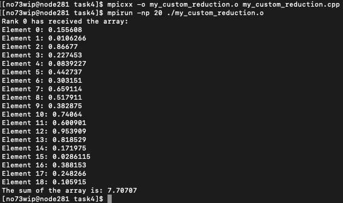

.. _ch:Task_3_1:

Report Week 5
=============

.. _ch:Contribution_3:

Contribution
------------

Bohdan Babii: Documentation, Part 1 - 6

Denis Novikau: Part 1 - 9

Lucas Obitz: Part 1 - 9

.. _ch:part_3_1:

.. admonition:: Task

  #. Implement a simple non-blocking summation **function** named ``my_custom_reduction``.
  #. In each process (except the root), initialize a random double value.
  #. Every process sends its own value to the root process.
  #. The root process gathers these values from all other processes and stores in **one array, sorted by the senders' ranks**.
  #. The root process prints out the received array and the summed value.
  #. Try out the function.
  #. Provide a screenshot of your results.
  #. Upload the used SLURM script, output and error files.
  #. Research and identify an MPI command that closely resembles this specified operation, offering a brief description of its functionality and usage.

  Note: 

  - You are just allowed to use **non-blocking** functions.

my_custom_reduction
-------------------

The my_custom_reduction function, utilizing MPI in C++, implements a non-blocking summation approach. Each process, excluding the root, asynchronously sends a randomly generated double value to the root process using MPI_Isend. Simultaneously, the root process collects these values using non-blocking MPI_Irecv, organizing them in an array sorted by sender ranks. MPI_Test ensures non-blocking behavior. After completion, the root process prints the received array and its summed values, providing an efficient parallelized summation in a distributed computing setup.

**summation function:**

.. code-block:: c++
    :linenos:

    void my_custom_reduction() {
        int l_rank;
        int l_comm_size;

        MPI_Comm_rank(MPI_COMM_WORLD, &l_rank);
        MPI_Comm_size(MPI_COMM_WORLD, &l_comm_size);

        MPI_Request send_request, recv_request;
        MPI_Status send_status, recv_status;

        std::srand(std::time(0) + l_rank);

        if ( l_rank == 0 )
        {
            double data_array[l_comm_size - 1];
            int message_tag = 777;

            // puts the element at the sender ranks position - 1
            for ( int i = 1; i < l_comm_size; i++)
            {
            int receiver_rank = i;
            MPI_Irecv(&data_array[i - 1], 1, MPI_DOUBLE, receiver_rank, message_tag, MPI_COMM_WORLD, &recv_request);

            int flag = 0;
            while(flag == 0) 
            {
                MPI_Test(&recv_request, &flag, &recv_status);
            }
            }

            double sum_data = 0.0;

            // printing out every value received and the summed up value
            std::cout << "Rank " << l_rank << " has received the array:" << std::endl;
            for ( int i = 0; i < l_comm_size - 1; i++)
            {
            sum_data += data_array[i];
            std::cout << "Element " << i << ": " << data_array[i] << std::endl;
            }
            std::cout << "The sum of the array is: " << sum_data << std::endl;
        }
        else 
        {
            // every rank except rank 0 sends a random value

            double send_data = static_cast<double>(std::rand()) / RAND_MAX;
            MPI_Isend(&send_data, 1, MPI_DOUBLE, 0, 777, MPI_COMM_WORLD, &send_request);

            int flag = 0;
            while(flag == 0) {
            MPI_Test(&send_request, &flag, &send_status);
            }
        }
    }

Screenshot
----------

SLURM script
------------

.. literalinclude:: ../../../src/week_6/my_custom_reduction.sh
    :linenos:

SLURM output
------------

.. literalinclude:: ../../../src/week_6/my_custom_reduction_job.out
    :linenos:

SLURM error
-----------

.. literalinclude:: ../../../src/week_6/my_custom_reduction_job.err
    :linenos:

MPI command
-----------

The right command is **MPI_Gatherv**.

#. Functionality:

    * It performs a gather operation.
    * Gathers data from all processes in the communicator to a single process.

#. Usage

    .. code-block:: c++
        :linenos:

        int MPI_Gatherv(const void *sendbuf, 
                        int sendcount, 
                        MPI_Datatype sendtype,
                        void *recvbuf, 
                        const int *recvcounts, 
                        const int *displs,
                        MPI_Datatype recvtype, 
                        int root,  
                        MPI_Comm comm           )

    **INPUT PARAMETERS**

    * **sendbuf**       - starting address of send buffer (choice)
    * **sendcount**     - number of elements in send buffer (integer) 
    * **sendtype**      - data type of send buffer elements (handle) 
    * **recvcounts**    - integer array (of length group size) containing the number of elements that are received from each process (significant only at root)
    * **displs**        - integer array (of length group size). Entry i specifies the displacement relative to recvbuf at which to place the incoming data from process i (significant only at root) 
    * **recvtype**      - data type of recv buffer elements (significant only at root) (handle) 
    * **root**          - rank of receiving process (integer) 
    * **comm**          - communicator (handle)

    **OUTPUT PARAMETERS**

    * **recvbuf**       - address of receive buffer (choice, significant only at root) 