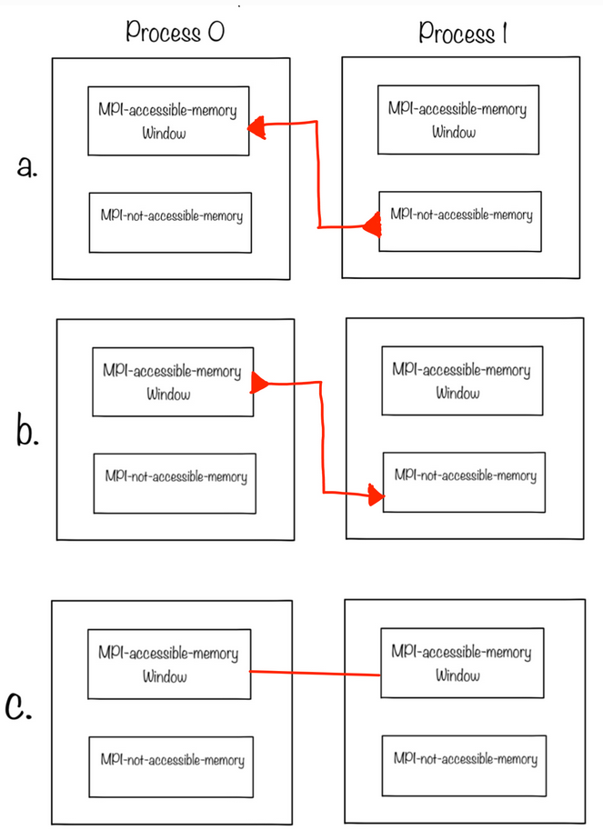

.. _ch:Task_5_1:

Report Week 7
=============

.. _ch:Contribution_5:

Contribution
------------

Bohdan Babii: Documentation, Part 9.2

Denis Novikau: Part 9.2, 9.3

Lucas Obitz: Part 9.2, 9.3

.. _ch:part_5_2:

Window Allocation
-----------------

.. admonition:: Task

  Consider **Fig. 9.2.1**, write three different executable C/C++ programs for each of the three items (a, b, c) with the appropriate MPI communication. 
  Utilize active target synchronization with fences and consider the transferred data is just an integer value.

a
^

This MPI program demonstrates one-sided communication through a "PUT" operation. In a two-process scenario, Rank 0 initializes a shared variable, and Rank 1 updates it using MPI_Put. The program emphasizes basic MPI window operations for shared memory access, with synchronized communication between the two ranks.

.. code-block:: c++
    :linenos:

    ...

    // communicate within fences
    MPI_Win_fence( MPI_MODE_NOPRECEDE,  // assert
                    l_win );            // win

    if( l_rank == 1 ) {
        MPI_Put( &l_data,  // origin_addr
                1,         // origin_count
                MPI_INT,   // origin_datatype
                0,         // target_rank
                0,         // target_disp
                1,         // target_count
                MPI_INT,   // target_datatype
                l_win );   // win
    }

    MPI_Win_fence( 0,           // assert
                    l_win );    // win

    ...

b
^

This MPI program illustrates one-sided communication, focusing on the "GET" operation. In a two-process setup, Rank 0 initializes a shared variable, and both ranks display their initial data values. A window is created for shared memory access, and communication occurs within fences for synchronization. Specifically, Rank 1 uses MPI_Get to retrieve the data from Rank 0. 

.. code-block:: c++
    :linenos:

    ...

    // communicate within fences
    MPI_Win_fence( MPI_MODE_NOPRECEDE,  // assert
                    l_win );            // win

    if( l_rank == 1 ) {
        MPI_Get( &l_data,  // origin_addr
                1,         // origin_count
                MPI_INT,   // origin_datatype
                0,         // target_rank
                0,         // target_disp
                1,         // target_count
                MPI_INT,   // target_datatype
                l_win );   // win
    }

    MPI_Win_fence(  0,           // assert
                    l_win );    // win
    
    ...

c
^

This MPI program showcases two-sided communication with "PUT" and "GET" operations. In a two-process scenario, Rank 0 initializes a shared variable, and both ranks display their initial data. MPI windows are used for shared memory, and synchronization occurs within fences. Rank 1 updates Rank 0's data with MPI_Put, followed by a local update by Rank 0. Then, Rank 1 retrieves the modified data using MPI_Get. 

.. code-block:: c++
    :linenos:

    ...

    // communicate within fences
    MPI_Win_fence( MPI_MODE_NOPRECEDE,  // assert
                    l_win );            // win

    if( l_rank == 1 ) {
        MPI_Put( &l_data,  // origin_addr
                1,         // origin_count
                MPI_INT,   // origin_datatype
                0,         // target_rank
                0,         // target_disp
                1,         // target_count
                MPI_INT,   // target_datatype
                l_win );   // win
    }

    MPI_Win_fence( 0,       // assert
                    l_win ); // win

    // print
    if ( l_rank == 0 )
    {
        std::cout << "rank " << l_rank << " with data: " << l_data << " after PUT and before GET." << std::endl;
        l_data = 99;
        std::cout << "rank " << l_rank << " with data update: " << l_data << " before GET." << std::endl;
    }
    else
    {
        std::cout << "rank " << l_rank << " with data: " << l_data << " after PUT and before GET." << std::endl;
    }

    if( l_rank == 1 ) {
        MPI_Get( &l_data,  // origin_addr
                1,         // origin_count
                MPI_INT,   // origin_datatype
                0,         // target_rank
                0,         // target_disp
                1,         // target_count
                MPI_INT,   // target_datatype
                l_win );   // win
    }

    // Necessary fence for global update
    MPI_Win_fence(  0,       // assert
                    l_win ); // win

    ...

Synchronization mechanisms
--------------------------

Let's say we have a buffer called ``buf``. The buffer's size in the process with rank 0 is equal to the number of processes. On all other processes ``buf`` may hold just one value. Initially we set the buffers' values to ``rank * 10``. The objective is to use ``MPI_Put`` so that rank 0 gathers the values of all other ranks. For instance, if we have 4 processes, the final ``buf`` on rank 0 should look like: ``[0.0, 10.0, 20.0, 30.0]``.

.. admonition:: Task
  
  Implement the described procedure using:

  #. **General active** target synchronization.
  #. **Passive** target synchronization.

General active
^^^^^^^^^^^^^^

This MPI program illustrates coordinated two-sided communication between processes. Each rank initializes data, and initial values are displayed. MPI windows facilitate shared memory access, and communication is organized within specific groups. Rank 0 sets up a reception group, while other ranks prepare groups for sending data to Rank 0. The program executes MPI window operations for synchronized communication (MPI_Win_post, MPI_Win_wait, MPI_Win_start, MPI_Put, MPI_Win_complete). Updated data values are then printed for Rank 0. 

.. literalinclude:: ../../../src/week_7/Task9.3/general_active.cpp
    :linenos:

Passive
^^^^^^^

This MPI program demonstrates coordinated communication between processes. Each rank initializes data, and initial values are displayed. MPI windows are used for shared memory access, with data modification on Rank 0 and printing on other ranks. The program executes MPI window operations (MPI_Win_create, MPI_Win_fence, MPI_Win_lock, MPI_Put, MPI_Win_unlock, MPI_Win_free) for synchronized communication. Updated data values are then printed for Rank 0.

.. literalinclude:: ../../../src/week_7/Task9.3/passive.cpp
    :linenos:

